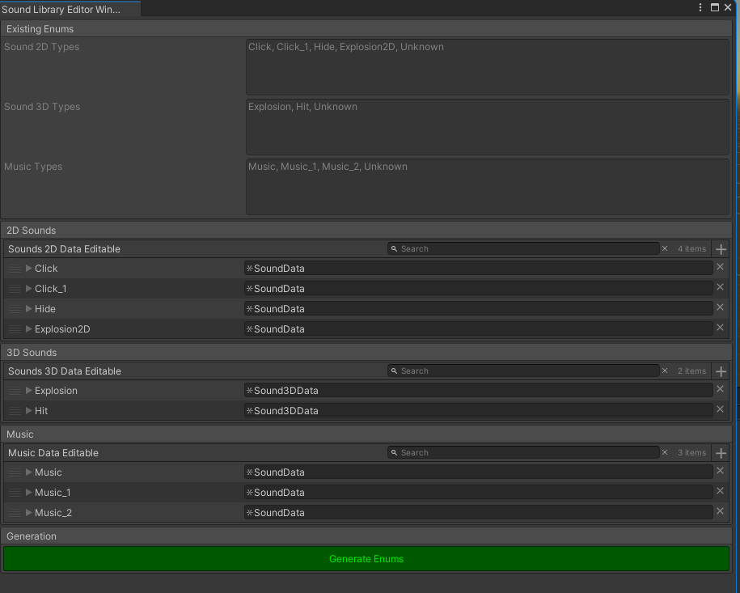
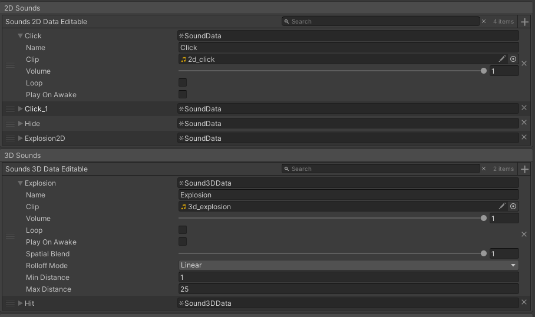
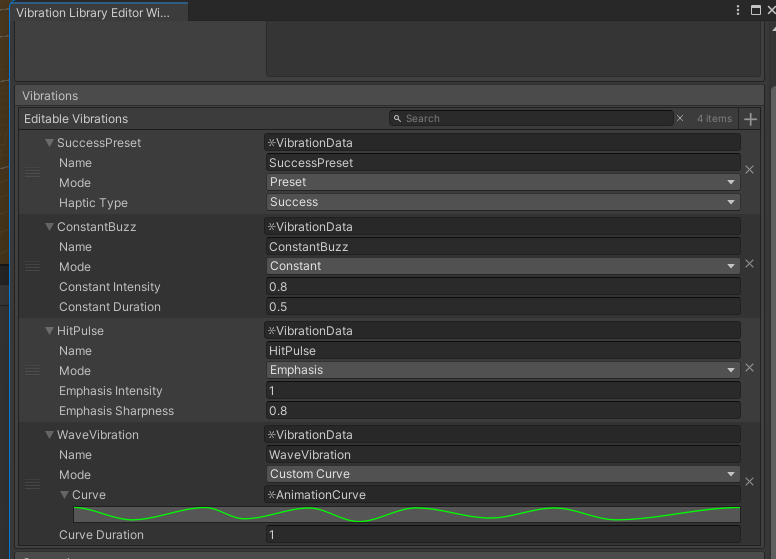
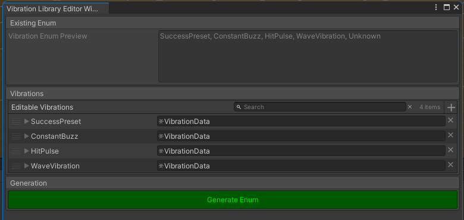
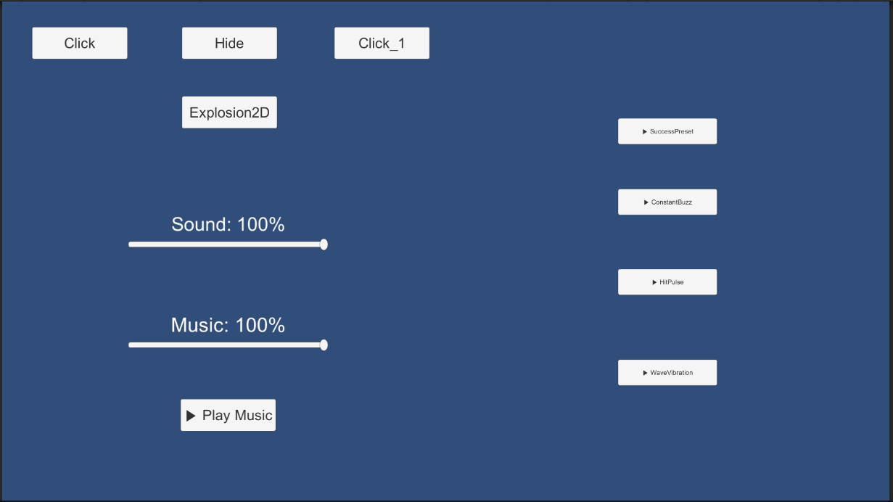
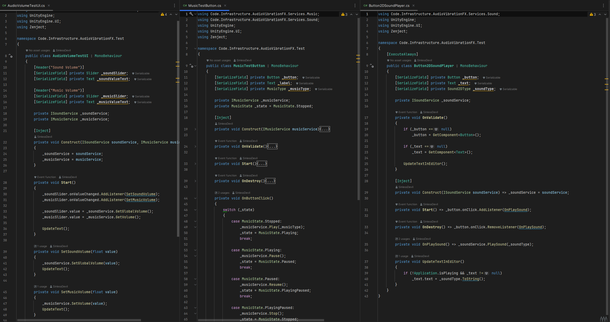
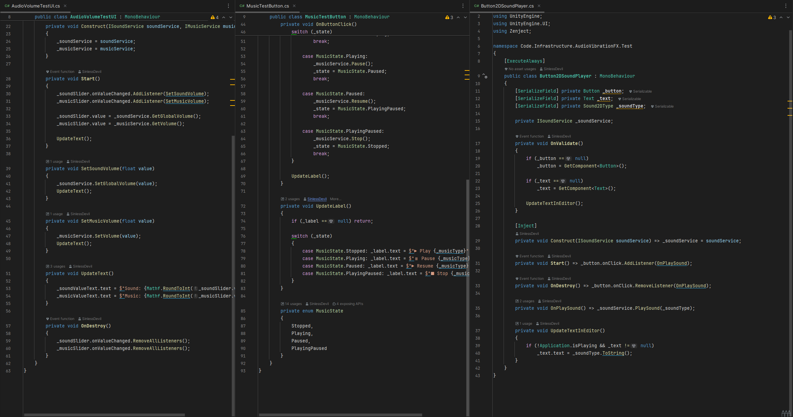
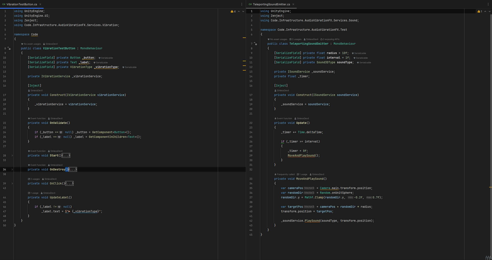

# AudioVibrationKit 🔊📳

A modular Unity toolkit for managing 2D/3D audio, music playback, and advanced haptic feedback with powerful editor tools and runtime flexibility.

---

## ✨ Features

- 🎵 **Audio & Music Management**
  - 2D and 3D sounds with audio pooling
  - Music playback with pause/resume/stop and smooth transitions
  - Global volume control

- 📳 **Vibration System** *(powered by [NiceVibrations](https://assetstore.unity.com/packages/tools/integration/nice-vibrations-haptics-for-mobile-136645))*
  - Preset, Constant, Emphasis and **CustomCurve** modes
  - Curve-based vibration playback with `AnimationCurve` using UniTask
  - Real-time updates with cancellation support

- 🛠 **Full Odin-based Editor Tools**
  - Sound/Music/Vibration editors with real-time previews
  - Auto-generated enums (e.g. `Sound2DType`, `MusicType`, `VibrationType`)
  - Built-in enum sync after compile

- 🔧 **ScriptableObject-based architecture** — clean and extendable
- 📱 **Android ready** — optimized for runtime builds

---

## 📸 Screenshots

### 🎛 Sound & Music Editors
<p align="center">
  
  
</p>

### 📳 Vibration Editor
<p align="center">
  
  
</p>

### 🧪 Test UI & Code
<p align="center">
  
  
</p>

<p align="center">
  
  
</p>

---

## 🚀 Getting Started

### Dependencies

- [Odin Inspector (Asset Store)](https://assetstore.unity.com/packages/tools/utilities/odin-inspector-and-serializer-89041)
- [UniTask](https://github.com/Cysharp/UniTask)
- [NiceVibrations](https://assetstore.unity.com/packages/tools/integration/nice-vibrations-haptics-for-mobile-136645)

> All tools and services are injected using Zenject (optional)

---

## 💡 Usage Example

```csharp
_soundService.Play(Sound2DType.Click);
_soundService.Play(Sound3DType.Explosion, transform.position);
_musicService.Play(MusicType.Battle);
_musicService.Pause();
_musicService.Resume();

_vibrationService.Play(VibrationType.HitPulse);
_vibrationService.Stop();
